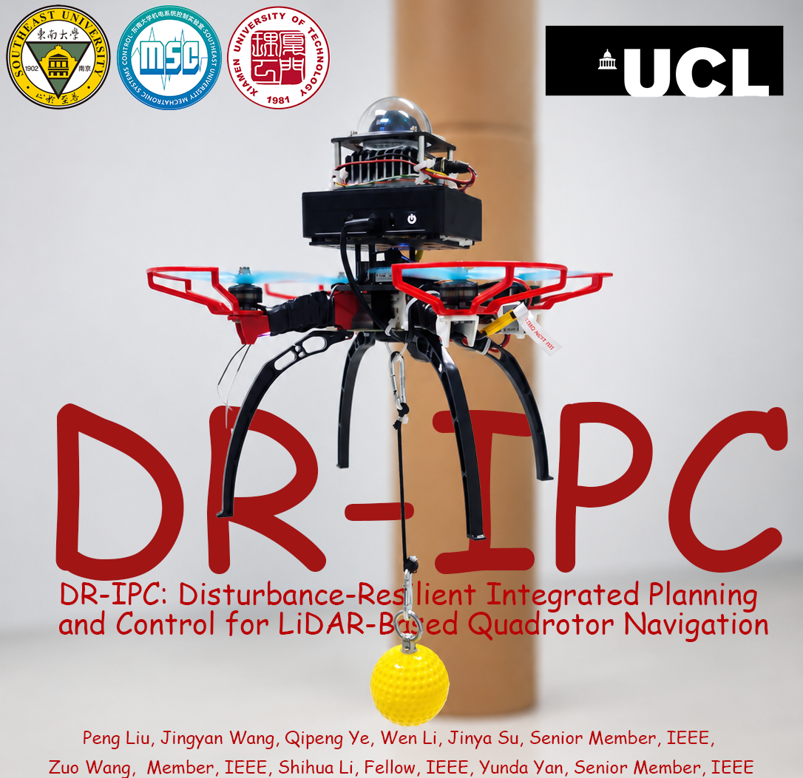
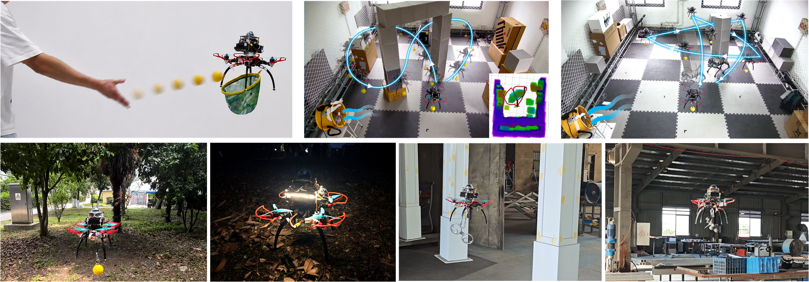

# DR-IPC: Disturbance-Resilient Integrated Planning and Control for LiDAR-Based Quadrotor Navigation

Official project page for the paper **“DR-IPC: Disturbance-Resilient Integrated Planning and Control for LiDAR-Based Quadrotor Navigation.”**




## Authors

Peng Liu<sup>1</sup>, Jingyan Wang<sup>1</sup>, Qipeng Ye<sup>2</sup>, Wen Li<sup>1</sup>, Jinya Su<sup>1,3</sup>, Zuo Wang<sup>1</sup>, Shihua Li<sup>1,3</sup>, and Yunda Yan<sup>4</sup>

<sup>1</sup> School of Automation, Southeast University
<sup>2</sup> Xiamen University of Technology
<sup>3</sup> Institute of Intelligent Unmanned Systems, Southeast University
<sup>4</sup> University College London

## Links

- **Project page:** https://drpp316.github.io/DR-IPC-Page/
- **Paper:** [DR_IPC.pdf](static/pdfs/DR_IPC.pdf) — **Coming soon**
- **Code:** [github.com/drpp316/DR_IPC](https://github.com/drpp316/DR_IPC) — **Coming soon**
- **Video:** Bilibili link  — **Coming soon**

## Experimental Demonstrations



The project page contains demonstrations of:

- Throwing-ball impact in hover
- Suspended-payload transportation with wind
- Suspended-payload transportation with a dynamic obstacle
- Outdoor flight experiments
- Outdoor flight at night
- Disturbance-resilient UAV transport in a cluttered factory

## Citation

```bibtex
@article{liu2026dripc,
  title  = {DR-IPC: Disturbance-Resilient Integrated Planning and Control for LiDAR-Based Quadrotor Navigation},
  author = {Liu, Peng and Wang, Jingyan and Ye, Qipeng and Li, Wen and Su, Jinya and Wang, Zuo and Li, Shihua and Yan, Yunda},
  year   = {2026}
}
```

> The manuscript and code repository are still being updated. Final publication information will be added after acceptance.

## Acknowledgments

This project page is based on the [Academic Project Page Template](https://github.com/eliahuhorwitz/Academic-project-page-template), which was adapted from the [Nerfies](https://nerfies.github.io/) project page.
